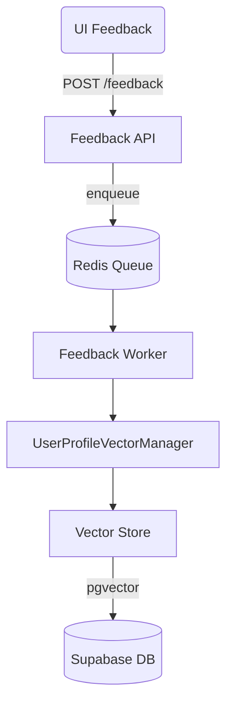

# InsightHub Architecture

This document provides a high-level overview of the InsightHub system architecture.

## Core Components

InsightHub is comprised of two main components:

1.  **Backend:** A Python-based application responsible for:
    *   Fetching data from external sources (Reddit, YouTube).
    *   Processing and enriching data using AI/ML models (LangChain).
    *   Providing a Streamlit web interface.
    *   Managing data persistence.

2.  **Frontend:** A SvelteKit single-page application (SPA) that provides the user interface for:
    *   Configuring data sources.
    *   Displaying aggregated content.
    *   Interacting with the AI-powered features.

## Data Flow

1.  The **Frontend** makes requests to the **Backend** API.
2.  The **Backend** fetches data from external APIs (Reddit, YouTube).
3.  This data is then processed by the AI pipeline for summarization, scoring, and personalization.
4.  The processed data is returned to the **Frontend** for display.

### Core Orchestrator (Task 31) ✅

The orchestration layer manages the AI content processing pipeline through a **LangGraph StateGraph** with intelligent retry logic, optimization, and error handling.

#### Architecture Components

| Component | Module | Purpose |
|-----------|--------|---------|
| **StateGraph** | `src/orchestrator/graph.py` | Node topology: fetcher→summarizer→embedding→scorer→storage |
| **Main Orchestrator** | `src/orchestrator/main.py` | Batch processing, retry logic, circuit breaker patterns |
| **OptimizedOrchestrator** | `src/orchestrator/optimization.py` | Metrics-driven tuning with OptimizerMetricsTuner |
| **ErrorHandlerNode** | `src/orchestrator/nodes/error_handler.py` | Terminal error processing with classification & recovery hints |

#### Processing Nodes

- **ContentFetcher** - YouTube/Reddit content retrieval
- **Summarizer** - AI-powered content summarization  
- **Embedding** - Vector embedding generation
- **ContentScorer** - Relevance scoring algorithm
- **Storage** - Supabase persistence layer

#### Key Features

* **Retry Management** - SmartRetryManager with exponential backoff
* **Circuit Breaker** - Automatic failure protection
* **Optimization Switch** - Toggle between standard/optimized execution (`ENABLE_OPTIMIZATIONS`)
* **Error Classification** - Network/timeout/permanent error handling
* **Metrics Integration** - Cache hit/miss tracking, processing times
* **LangSmith Monitoring** - Full observability pipeline

#### Usage

```python
from src.orchestrator.main import Orchestrator
orchestrator = Orchestrator()
result = await orchestrator.process_content("https://youtube.com/watch?v=...")
```

See **[AI_PIPELINE.md](./backend/AI_PIPELINE.md)** for detailed implementation docs.

## User Feedback Loop & Vector Storage (added in Tasks #6 & #12)



* **Feedback API** – lightweight FastAPI app, returns 202 immediately.
* **Redis queue + worker** decouple heavy vector math from request latency.
* **Vector math** lives in `src/models/vector_math.py` with granular projection handlers.
* **Vector store** abstraction chooses In-Memory or Supabase backend at runtime via env vars.
* **Supabase** hosts `user_vectors` & `content_vectors` tables with HNSW indexes for fast ANN search.

This modular design keeps the main event-processing graph decoupled from persistence technology and allows easy horizontal scaling.
