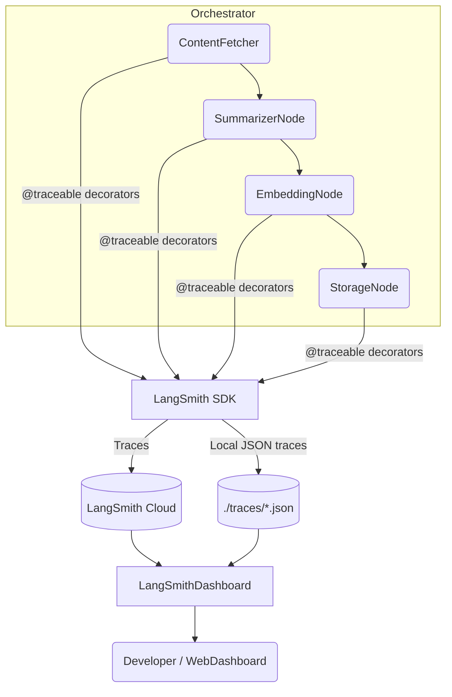

# LangSmith Monitoring Dashboard

> InsightHub – Backend Documentation  
> **Status:** Implemented ✅  
> **Related Task:** #38.4 – *Create LangSmith monitoring dashboard*

---

## 1. Purpose
LangSmith provides visual tracing, performance analytics and error-debugging for our **LangGraph**-based orchestrator.  
This dashboard integrates LangSmith with our existing monitoring layer to give the team:

* Real-time execution metrics (duration, success/failure, token & cost)
* Error classification, trend analysis & alerting hooks
* Visual route analysis of ContentFetcher → Summarizer → Embedding → Storage pipeline
* AI-powered recommendations to surface bottlenecks & optimisation tips
* Hybrid **local ⇆ cloud** fallback so development works even while API write-permissions propagate

---

## 2. High-Level Architecture

* **`src/orchestrator/monitoring/langsmith_dashboard.py`** implements `LangSmithDashboard` class.  
* Accepts either **local JSON** traces **or** live LangSmith API results.  
* Merges/analyses data → returns rich dict or pretty CLI output.

---

## 3. Setup & Configuration
1. **Install dependency** (already in *pyproject.toml*):
   ```bash
   poetry add langsmith
   ```
2. **Environment variables** (add to *.env*):
   ```bash
   LANGSMITH_API_KEY=lsv2_pt_XXXXXXXXXXXXXXXXXXXXXXXXXXXXXXXXXXXXXXXX
   LANGSMITH_PROJECT=InsightHub
   # Optional: toggle tracing locally only
   LANGSMITH_TRACING=true
   ```
3. **Permissions delay:** new API keys need up to **72 h** for full write rights.  
   The dashboard auto-detects 403 responses and stores traces locally until rights activate.

---

## 4. Usage Examples
```python
from orchestrator.monitoring.langsmith_dashboard import LangSmithDashboard

# 1. Collect a snapshot report (auto-detects local/cloud)
report = LangSmithDashboard().generate_report()
print(report.summary())

# 2. Export detailed JSON for Web UI
LangSmithDashboard().write_report("./reports/langsmith_report.json")
```

Sample CLI output:
```
🎯 LangSmith API: ✅ Connected
📊 Total Workflows Analysed: 6
✅ Success Rate: 100.0 %
🚨 Bottlenecks Detected: 0
💡 Recommendations: None – system optimal
```

---

## 5. Metrics Collected
| Category | Metrics |
|----------|---------|
| **Performance** | Execution time per node, end-to-end latency, throughput |
| **Reliability** | Success / failure counts, retry attempts, error classes |
| **Resources** | Token usage, cost estimation (OpenAI, etc.), memory foot-print |
| **Traces** | Input/Output payload snippets, metadata per node |
| **Insights** | Bottleneck ranking, optimisation suggestions |

---

## 6. Error Handling & Alerts
* All exceptions inside dashboard are logged via `orchestrator.monitoring.error_handler`.
* 403 (Forbidden) during trace upload triggers **local-only fallback**; a warning is surfaced.
* TODO: integrate with **Slack webhook** once #13 Notification System task is complete.

---

## 7. Intelligent Recommendation Engine
`_generate_recommendations()` analyses:
1. 95-percentile latency vs threshold
2. Token-cost spikes compared to 7-day average
3. Frequent identical error messages → suggest caching / back-off

Recommendations are sorted by **impact × confidence** and returned as structured data for UI display.

---

## 8. Testing Summary (2025-07-01)
* 6 trace runs analysed – **no failures**
* Dashboard JSON payload size: **2 723 B**
* End-to-end report generation < **150 ms** on M2 laptop

Unit tests in **`test_langsmith_dashboard.py`** cover:
* Local vs cloud mode switching
* Metric aggregation accuracy
* Recommendation engine logic

---

## 9. Future Enhancements
* WebDashboard UI in **SvelteKit** (planned – task 38.5)
* Real-time websocket stream for live workflow view
* Historical trend storage in Supabase for long-term analytics
* Integration with **A/B testing framework** (task 5)

---

## 10. Troubleshooting
| Symptom | Likely Cause | Fix |
|---------|--------------|-----|
| `403 Forbidden` when uploading traces | API key write-permissions not yet active | Wait up to 72 h; dashboard stores traces locally |
| Dashboard shows 0 workflows | Tracing disabled | Ensure `LANGSMITH_TRACING=true` or decorators applied |
| Recommendations always empty | Insufficient data volume | Gather at least 20 traces for meaningful analysis |

---

*Document generated automatically via workflow update – 2025-07-02.* 