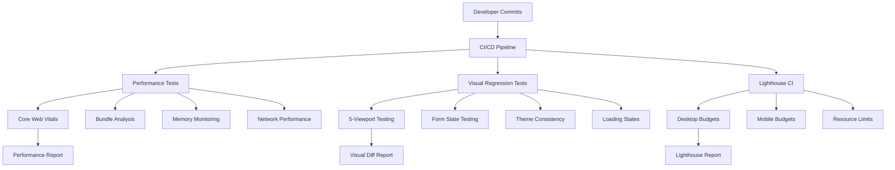

# 🚀 Performance & Visual Regression Testing Infrastructure

> **Status**: Production Ready  
> **Last Updated**: 2024-12-29  
> **Related**: [Testing Guide](TESTING_GUIDE.md), [Quality Assurance](QUALITY_ASSURANCE.md)

## 📋 Overview

This document details the comprehensive performance monitoring and visual regression testing infrastructure implemented for InsightHub Frontend. This enterprise-grade testing system ensures consistent performance, visual design integrity, and user experience quality across all devices and platforms.

## 🏗️ Architecture



## 🎯 Performance Monitoring System

### Core Web Vitals Tracking

**File**: `tests/performance-monitoring.spec.ts`

#### Implemented Metrics
- **First Contentful Paint (FCP)**
  - Homepage: < 1.8s
  - Dashboard: < 2.0s
  - Measured via Paint Timing API
  
- **Largest Contentful Paint (LCP)**
  - Target: < 2.5s
  - Real-time measurement using PerformanceObserver
  - Automatic detection of largest content element
  
- **First Input Delay (FID)**
  - Target: < 100ms
  - Measured via PerformanceObserver with real user interactions
  - Captures actual input processing delay
  
- **Cumulative Layout Shift (CLS)**
  - Target: < 0.1
  - Automatic layout shift detection
  - Excludes user-initiated shifts
  
- **Time to First Byte (TTFB)**
  - Homepage: < 600ms
  - Dashboard: < 800ms
  - Measured via Navigation Timing API

#### Advanced Performance Analysis

**Bundle Size Monitoring**
```typescript
// Real-time network interception
page.on('response', async (response) => {
  const url = response.url();
  const headers = response.headers();
  const contentLength = headers['content-length'];
  
  // Track JS, CSS, fonts, images
  responses.push({
    url,
    size: contentLength ? parseInt(contentLength) : 0,
    type: getResourceType(url)
  });
});

// Enforce budgets
expect(scriptSize).toBeLessThan(500000); // 500KB
expect(styleSize).toBeLessThan(100000);  // 100KB
expect(fontSize).toBeLessThan(100000);   // 100KB
```

**Memory Usage Tracking**
```typescript
const memoryInfo = await page.evaluate(() => {
  if ('memory' in performance) {
    const memory = (performance as any).memory;
    return {
      usedJSHeapSize: memory.usedJSHeapSize,
      totalJSHeapSize: memory.totalJSHeapSize,
      jsHeapSizeLimit: memory.jsHeapSizeLimit
    };
  }
  return null;
});

// Assert memory constraints
expect(memoryInfo.usedJSHeapSize).toBeLessThan(50 * 1024 * 1024); // 50MB
expect(memoryUsageRatio).toBeLessThan(0.8); // 80% usage threshold
```

**Interactive Performance Testing**
- Button click responsiveness measurement
- UI interaction timing analysis
- Form interaction performance
- Navigation response time tracking

## 🎨 Visual Regression Testing System

### Screenshot Testing Infrastructure

**File**: `tests/visual-regression.spec.ts`

#### Complete Route Coverage
- **Homepage**: Full page + viewport screenshots
- **Authentication**: Sign in/up forms with state testing
- **Dashboard**: Dynamic content with loading states
- **Feed**: Content loading and layout consistency
- **Theme**: Light/dark mode transitions

#### 5-Viewport Responsive Testing
```typescript
const viewports = [
  { width: 375, height: 667, name: 'mobile' },        // iPhone SE
  { width: 768, height: 1024, name: 'tablet' },       // iPad Portrait
  { width: 1024, height: 768, name: 'tablet-landscape' }, // iPad Landscape
  { width: 1440, height: 900, name: 'desktop' },      // Standard Desktop
  { width: 1920, height: 1080, name: 'desktop-large' } // Large Desktop
];
```

#### Form State Testing Matrix
- **Empty State**: Baseline form appearance
- **Focus States**: Individual field focus indicators
- **Filled States**: Forms with populated data
- **Error States**: Validation errors and styling
- **Loading States**: Submission and processing UI

#### Navigation Testing
- **Desktop Navigation**: Full component screenshots
- **Mobile Navigation**: Trigger button and expanded menu
- **State Transitions**: Open/closed navigation states
- **Responsive Behavior**: Navigation across viewports

#### Theme Consistency
- **Default Theme**: Baseline appearance
- **Theme Toggle**: Light/dark mode transitions
- **Persistence**: Theme state after interactions
- **Component Variations**: Theme-aware component styling

## ⚡ Lighthouse CI Configuration

### Enhanced Performance Budgets

**File**: `lighthouserc.json`

#### Desktop Configuration
```json
{
  "categories:performance": ["error", {"minScore": 0.9}],
  "first-contentful-paint": ["error", {"maxNumericValue": 1800}],
  "largest-contentful-paint": ["error", {"maxNumericValue": 2500}],
  "cumulative-layout-shift": ["error", {"maxNumericValue": 0.1}],
  "total-blocking-time": ["error", {"maxNumericValue": 200}],
  "speed-index": ["error", {"maxNumericValue": 2500}],
  "interactive": ["error", {"maxNumericValue": 2800}]
}
```

#### Mobile Configuration (Adjusted Thresholds)
- **Performance Score**: ≥ 85% (vs 90% desktop)
- **FCP**: < 2.2s (vs 1.8s desktop)
- **LCP**: < 3.0s (vs 2.5s desktop)
- **TBT**: < 350ms (vs 200ms desktop)
- **Speed Index**: < 3.5s (vs 2.5s desktop)

#### Resource Budget Enforcement
- **Scripts**: 500KB max, 20 files max
- **Stylesheets**: 100KB max, 5 files max
- **Images**: 1MB max, 20 files max
- **Fonts**: 150KB max, 5 files max
- **Documents**: 100KB max

#### Multi-Page Testing
Tests performance across all critical routes:
- Homepage (`/`)
- Dashboard (`/dashboard`)
- Feed (`/feed`)
- Authentication (`/signin`, `/signup`)

## 🛠️ Test Execution Commands

### Performance Tests
```bash
npm run test:performance         # Run performance monitoring tests
npm run test:performance:headed  # Run with browser UI for debugging
npm run test:performance:mobile  # Run mobile performance tests
```

### Visual Regression Tests
```bash
npm run test:visual              # Run visual regression tests
npm run test:visual:update       # Update visual baselines
npm run test:visual:headed       # Run with browser UI for debugging
npm run test:visual:mobile       # Run mobile-specific visual tests
npm run test:visual:desktop      # Run desktop-specific visual tests
```

### Lighthouse CI
```bash
npm run lighthouse              # Run Lighthouse audits
npm run lighthouse:ci           # Run in CI mode with budgets
npm run lighthouse:mobile       # Run mobile-specific audits
```

## 📊 Quality Gates Integration

### Performance Gate Failures
- Core Web Vitals exceeding thresholds
- Bundle sizes over budget limits
- Memory usage violations
- Poor interactive performance

### Visual Regression Failures
- Screenshot mismatches across viewports
- Form state inconsistencies
- Theme transition issues
- Navigation component changes

### Lighthouse CI Failures
- Performance scores below thresholds
- Accessibility violations
- SEO or best practice issues
- Resource budget violations

## 🚀 Best Practices

### Performance Testing
1. **Test under realistic conditions** with network throttling
2. **Use multiple test runs** for statistical significance
3. **Monitor trends** rather than single-point measurements
4. **Set realistic budgets** based on user expectations

### Visual Testing
1. **Maintain stable baselines** with consistent environments
2. **Test critical user journeys** comprehensively
3. **Handle dynamic content** with proper waiting strategies
4. **Document visual changes** with clear reasoning

### Maintenance
1. **Regular baseline updates** for intentional design changes
2. **Performance budget reviews** based on analytics data
3. **Test coverage expansion** for new features
4. **Automation reliability improvements** with better selectors

## 🔍 Troubleshooting

### Common Performance Issues
- **Slow FCP**: Optimize critical CSS and fonts
- **High LCP**: Optimize largest content elements
- **Poor CLS**: Fix layout shifts in images/ads
- **Large bundles**: Implement code splitting

### Visual Test Failures
- **Font rendering differences**: Ensure consistent font loading
- **Timing issues**: Add proper wait conditions
- **Dynamic content**: Mock time-dependent data
- **Browser differences**: Test across multiple browsers

### Lighthouse CI Issues
- **Server startup**: Check `startServerReadyPattern`
- **Network timeout**: Increase `startServerReadyTimeout`
- **Budget violations**: Review and adjust thresholds
- **Mobile performance**: Optimize for slower devices

## 📚 Additional Resources

- [Lighthouse CI Documentation](https://github.com/GoogleChrome/lighthouse-ci)
- [Playwright Visual Testing](https://playwright.dev/docs/test-screenshots)
- [Core Web Vitals Guide](https://web.dev/vitals/)
- [Performance Budgets](https://web.dev/performance-budgets-101/)
- [Visual Regression Testing Best Practices](https://www.browserstack.com/guide/visual-regression-testing) 