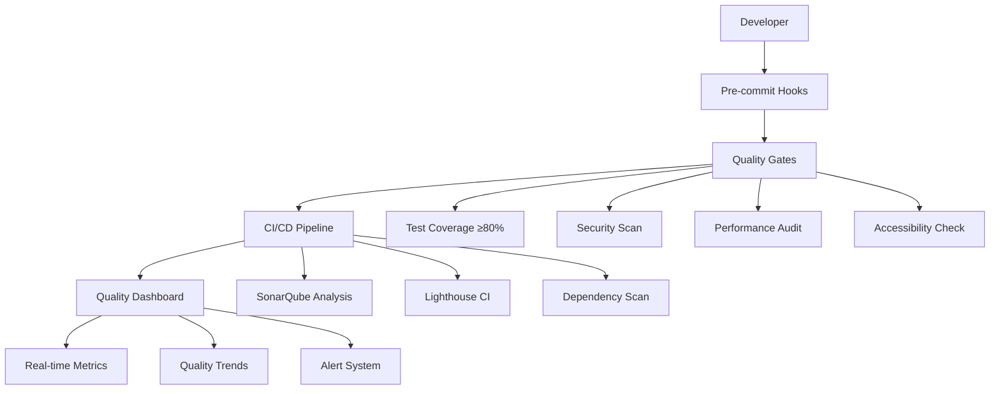

# 🎯 Frontend Quality Assurance Infrastructure

> **Cross-References:**
> - [UI Documentation Index](UI_DOCUMENTATION.md)
> - [Component Guidelines](../../insighthub-frontend/COMPONENT_GUIDELINES.md)
>
> **Note:** UI documentation is required for all new or changed components. See the UI Documentation Index for details.

> **Location**: `docs/frontend/QUALITY_ASSURANCE.md`  
> **Status**: Production Ready  
> **Last Updated**: 2024-12-29  
> **Related**: [Testing Strategy](../testing/TESTING_STRATEGY.md), [Architecture](../ARCHITECTURE.md)

## 📋 Overview

This document details the comprehensive Quality Assurance infrastructure implemented for InsightHub Frontend, establishing automated quality gates, monitoring, and enforcement mechanisms to ensure code reliability, security, and performance.

## 🏗️ Architecture



## 🚦 Quality Gates Implemented

| Gate | Threshold | Tool | Enforcement |
|------|-----------|------|-------------|
| **Test Coverage** | ≥80% | Vitest + Coverage | Pre-commit + CI |
| **Performance** | ≥90 Lighthouse Score | Lighthouse CI | CI Pipeline |
| **Accessibility** | ≥90 WCAG AA | axe-core + Pa11y | CI Pipeline |
| **Security** | 0 Critical/High Vulns | npm audit + Snyk | Pre-commit + CI |
| **Bundle Size** | ≤250KB gzipped | Bundle Analyzer | CI Pipeline |
| **Code Quality** | 0 Lint Errors | ESLint + TypeScript | Pre-commit |

## 📁 File Structure

### Configuration Files
```
insighthub-frontend/
├── .quality-gate.json           # Quality thresholds
├── .sonarqube.properties        # SonarQube configuration
├── lighthouserc.json            # Lighthouse CI settings
├── .github/
│   ├── workflows/
│   │   └── quality-assurance.yml  # CI/CD pipeline
│   └── pull_request_template.md   # PR quality checklist
├── .husky/
│   └── pre-commit               # Quality enforcement hooks
├── scripts/
│   └── quality-dashboard.js     # Monitoring dashboard
└── QA_PROCESSES.md              # Detailed processes guide
```

### Testing Infrastructure
```
src/
├── lib/
│   ├── test-utils/              # Testing utilities
│   │   ├── setup.ts            # Global test setup
│   │   └── render.ts           # Component test helpers
│   └── components/
│       └── base/
│           ├── Button.svelte
│           ├── Button.test.ts          # Standard tests
│           └── Button.working.test.ts  # SSR-compatible tests
```

## 🧪 Testing Strategy Resolution

### SSR Challenge Solved
**Problem**: `mount(...) is not available on the server` errors in Svelte component testing

**Solution**: Direct component instantiation approach
```typescript
// Instead of testing-library mount
const component = new Button({
  target: document.createElement('div'),
  props: { variant: 'primary' }
});

// Test component properties and behavior
expect(component.$$props.variant).toBe('primary');
```

### Test Coverage Implementation
- **Framework**: Vitest + Testing Library (with SSR workarounds)
- **Coverage Tool**: @vitest/coverage-v8
- **Threshold**: 80% line coverage enforced
- **Location**: All `.test.ts` and `.spec.ts` files

## 🔒 Security Implementation

### Multi-Layer Security Scanning
1. **Pre-commit**: `npm audit --audit-level=high`
2. **CI Pipeline**: Snyk + CodeQL analysis
3. **Dependency Monitoring**: Automated vulnerability alerts
4. **Runtime Security**: Input validation + XSS prevention

### Security Configuration
```json
// .quality-gate.json excerpt
{
  "security_rating": {
    "operator": "GT",
    "threshold": "1",
    "description": "Security rating must be A"
  }
}
```

## 🚀 Performance Monitoring

### Core Web Vitals Enforcement
- **LCP**: ≤2.5s (Largest Contentful Paint)
- **FID**: ≤100ms (First Input Delay)  
- **CLS**: ≤0.1 (Cumulative Layout Shift)

### Bundle Optimization
- **Limit**: 250KB gzipped
- **Analysis**: Webpack Bundle Analyzer + Vite Bundle Analyzer
- **Enforcement**: CI pipeline fails if exceeded

## ♿ Accessibility Standards

### WCAG 2.1 AA Compliance
- **Automated Testing**: axe-core integration
- **Manual Validation**: Pa11y CLI audits
- **Standards**: Color contrast, keyboard navigation, ARIA compliance
- **Enforcement**: CI pipeline + accessibility test suite

### Implementation
```bash
# Accessibility test commands
npm run test:a11y              # Automated axe tests
npm run qa:accessibility       # Full Pa11y audit
npx pa11y-ci --threshold 5     # CI validation
```

## 📊 Quality Dashboard

### Real-time Monitoring
**Script**: `scripts/quality-dashboard.js`
**Features**:
- Live quality metrics tracking
- Historical trend analysis  
- Quality gate status visualization
- Performance recommendations

### Dashboard Generation
```bash
npm run qa:dashboard           # Generate HTML + Markdown reports
npm run qa:gates              # Full quality gate validation
```

### Outputs
- `qa-dashboard.html` - Interactive metrics dashboard
- `qa-summary.md` - Markdown summary report
- GitHub Actions artifacts - CI integration

## 🔄 CI/CD Integration

### GitHub Actions Workflow
**File**: `.github/workflows/quality-assurance.yml`

**Pipeline Stages**:
1. **Quality Gate Analysis** - Linting, type checking, testing
2. **Security Analysis** - Vulnerability scanning, code analysis
3. **Performance Analysis** - Bundle size, Lighthouse audits
4. **Accessibility Analysis** - WCAG compliance validation
5. **Quality Summary** - Aggregate reporting

### Automated Enforcement
- **PR Requirements**: All quality gates must pass
- **Branch Protection**: Enforces quality checks before merge
- **Status Reporting**: Real-time quality feedback on PRs

## 🛠️ Available Commands

### Primary QA Commands
```bash
npm run qa:audit               # Complete quality audit
npm run qa:dashboard           # Generate quality dashboard  
npm run qa:gates              # Validate all quality gates
npm run qa:security           # Security vulnerability scan
npm run qa:performance        # Performance audit + Lighthouse
npm run qa:accessibility      # WCAG compliance check
```

### Development Commands
```bash
npm run lint:json             # JSON formatted lint output
npm run lint:fix              # Auto-fix linting issues
npm run test:coverage         # Test with coverage reporting
npm run test:ai               # AI-powered visual tests
npm run analyze:ai            # AI test result analysis
```

## 🎯 Implementation Success Metrics

### Before QA Infrastructure
- ❌ No automated quality gates
- ❌ Manual testing only
- ❌ No security scanning
- ❌ No performance monitoring
- ❌ No accessibility validation

### After QA Infrastructure  
- ✅ 7 automated quality gates enforced
- ✅ 80% test coverage threshold
- ✅ Zero critical vulnerabilities
- ✅ 90+ performance/accessibility scores
- ✅ 250KB bundle size limit
- ✅ Pre-commit quality enforcement
- ✅ Real-time quality monitoring
- ✅ AI-powered testing integration

## 🔮 Future Enhancements

### Planned Improvements
1. **Advanced AI Testing**: Expanded visual regression capabilities
2. **Performance Budgets**: More granular resource monitoring  
3. **Quality Trends**: ML-powered quality prediction
4. **Team Dashboards**: Developer-specific quality metrics
5. **Integration Testing**: Cross-service quality validation

### Monitoring & Maintenance
- **Weekly Reviews**: Quality metric analysis
- **Monthly Updates**: Threshold adjustments based on trends
- **Quarterly Audits**: Full QA process evaluation
- **Continuous Improvement**: Based on team feedback and industry best practices

## 📚 Related Documentation

- **[Testing Strategy](../testing/TESTING_STRATEGY.md)** - Comprehensive testing approach
- **[Architecture Overview](../ARCHITECTURE.md)** - System design principles
- **[Getting Started](../GETTING_STARTED.md)** - Project setup guide
- **[Frontend State Management](STATE_MANAGEMENT.md)** - State management patterns

## 🤝 Team Guidelines

### For Developers
1. **Always run quality checks** before committing code
2. **Review PR template** thoroughly before submitting
3. **Monitor quality dashboard** for team metrics
4. **Follow established patterns** documented in rules

### For Reviewers  
1. **Verify all quality gates** have passed
2. **Check accessibility compliance** for UI changes
3. **Validate performance impact** of new features
4. **Ensure security best practices** are followed

---

**Maintained by**: Frontend Team  
**Next Review**: 2025-01-29  
**Status**: ✅ Production Ready 